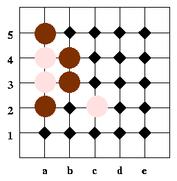

# Gothello

The game of Gothello bears some similarities to both Go and Othello. It
is played on the intersections of a 5x5 board

> 

by alternately placing dark ("black") and light ("white") stones

> 

By convention, the 25 intersections are lettered a-e in the horizontal
direction, and numbered 1-5 in the vertical direction, giving a unique
name for each intersection, as shown above.

The players alternate in placing a stone on an intersection: black goes
first. When a stone is placed in such a way that stones of the player on
move plus the outer wall completely enclose, with no gaps, a group of
the opponent's stones horizontally and vertically, the opponent's group
is *captured*, and changes color to the color of the capturing player. A
stone may be placed in any empty location on the board, except that
placing a stone in such a way as to make the player on move form a
captured group is prohibited.

A player may pass at any time, and must pass when no legal moves are
available. The game is over when both players have passed (in
particular, when all positions are filled). The winner is the player
with the most stones on the board at the end of the game: draws are
possible due to the restriction on placement discussed above.

## Examples

1.  In the position shown

    > 

    black moves to capture at b3

    > 

    capturing two white pieces

    > 

    Note that the left wall was part of the enclosure.

2.  In the position shown

    > 

    the white stones at e4, d3, and e2 are "safe". Black cannot play e3
    due to the capture restriction described above, while white may play
    e3 on any turn to complete the group.

    Note that this is different from Go: here we have "one eye lives"
    rather than Go's "two eyes live" because of the differing capture
    rule. The rules here were chosen to work better on the smaller
    board, where it is difficult to create two "eyes".

3.  In the (probably unreachable) position shown

    > 

    the game is tied, and black is on move. However, black must pass,
    since the play at e3 is still illegal. White will play e3 and win.

## Strategy and Programming

As in Go, it is important to create "eyes" to make safe formations. As
in Othello, it is important to build "walls" that the opponent cannot
easily capture.

As with any two-player alternating game, creating multiple simultaneous
threats is effective.

First player probably has a strong advantage: someone should build an
opening book.

An endgame database would be very useful, as many stones may change
hands in the last few moves.

Quickly computing and/or efficiently caching "groups" of connected
stones for capture purposes may make a search go *much* faster.
